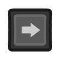

# Nintendo Game Boy Color

## Overview

The Game Boy Color (GBC) application for [webЯcade](https://www.webrcade.com) is an emulator for the [Game Boy Color](https://en.wikipedia.org/wiki/Game_Boy_Color) handheld game console.

<figure>
  
  <figcaption>µCity by Antonio Niño Díaz</figcaption>
</figure>


## Controls

The emulator supports one controller. The keyboard and gamepad mappings are listed in the tables below.

### Keyboard

Keyboard controls are listed below.

| __Name__ | <div style="min-width:140px">__Keys__</div> | __Comments__ |
|--------------------------|---------------------------------------------| |
| Move | {: class="control"} {: class="control"} {: class="control"} {: class="control"}  | |
| A | {: class="control"} or {: class="control"} | |
| B | {: class="control"} or {: class="control"} | |
| Start | {: class="control"} | |
| Select | {: class="control"} | The __Right Shift Key__.|
| Show Pause Screen | {: class="control"} | |

### Gamepad

Gamepad mappings are listed below.

| __Name__ | <div style="min-width:140px">__Gamepad__</div> | __Comments__ |
| --- | --- | --- |
| Move                         | {: class="control"} &nbsp;or&nbsp; {: class="control"} | |
| A                       | {: class="control"} or {: class="control"} | |
| B                       | {: class="control"} or {: class="control"} | |
| Start                        | {: class="control"} | Not available for Xbox and not recommended for iOS (see alternate)<br><br>Press the __Menu (Start) Button__. |
| Start<br>(Alternate)            | {: class="control"} &nbsp;and&nbsp; {: class="control"} | Hold down the __Right Trigger__ and click (press down) on the __Right Thumbstick__. |
| Select                       | {: class="control"}  | Not available for Xbox and not recommended for iOS (see alternate)<br><br>Press the __View (Back) Button__. |
| Select<br>(Alternate)           | {: class="control"} &nbsp;and&nbsp; {: class="control"} | Hold down the __Right Trigger__ and click (press down) on the __Left Thumbstick__. |
| Show Pause Screen                    | {: class="control"} &nbsp;and&nbsp; {: class="control"} | Not available for Xbox and not recommended for iOS (see alternate 3 or 4)<br><br>Hold down the __Left Trigger__ and press the __Menu (Start) Button__. |
| Show Pause Screen<br>(Alternate)        | {: class="control"} &nbsp;and&nbsp; {: class="control"} | Not available for Xbox and not recommended for iOS (see alternate 3 or 4)<br><br>Hold down the __Left Trigger__ and press the __View (Back) Button__. |
| Show Pause Screen<br>(Alternate 2)        | {: class="control"} &nbsp;and&nbsp; {: class="control"} | Not available for Xbox and not recommended for iOS (see alternate 3 or 4)<br><br>Hold down the __X Button__ and press the __View (Back) Button__. |
| Show Pause Screen<br>(Alternate 3)        | {: class="control"} &nbsp;and&nbsp; {: class="control"} | Hold down the __Left Trigger__ and click (press down) on the __Left Thumbstick__. |
| Show Pause Screen<br>(Alternate 4)        | {: class="control"} &nbsp;and&nbsp; {: class="control"} | Hold down the __Left Trigger__ and click (press down) on the __Right Thumbstick__. |

## Battery-backed SRAM

Some Game Boy Color cartridges include battery-backed SRAM as a means of preserving state between sessions. The Game Boy Color application supports persisting this SRAM state into the browser's local storage or optionally to [cloud-based storage](../../../storage/index.md). The SRAM contents will be persisted to storage whenever the pause screen is displayed (or the game is exited). Therefore, the menu should be displayed periodically for games that support battery-backed SRAM to ensure the state is properly persisted.

## Feed

This section details how Game Boy Color application instances can be added to feeds.

### Type

The type name for the Game Boy Color application is `vba-m-gbc`.

!!! note
    The alias `gbc` also currently maps to this application. In the future, the `gbc` alias may be mapped
    to another Nintendo Game Boy Color application (different emulator implementation) if it is determined to be a more appropriate default.

### Properties

The table below contains the properties that are specific to the Game Boy Color application. These properties are
specified in the `props` object of a feed item.

| __Property__ | __Type__ | __Required__ | __Details__ |
|----------|------|----------|---------|
| rom | URL | Yes | URL to a Game Boy Color ROM file or a zip file containing a ROM file. |
| zoomLevel | Numeric | No | A numeric value indicating how much the display image should be zoomed in (0-40).<br><br>This property is typically used to hide the black borders that are present on some games. |

### Example

The following is an example of a complete feed that consists of a single Game Boy Color application instance (`type` value of `gbc`). The `rom` property value is a URL that points to a Dropbox location that contains the excellent homebrew game µCity by Antonio Niño Díaz

``` json hl_lines="11 13"
{
  "title": "Game Boy Color Feed",
  "longTitle": "Nintendo Game Boy Color Example Feed",
  "categories": [
    {
      "title": "Game Boy Color Games",
      "longTitle": "Nintendo Game Boy Color Games",
      "items": [
        {
          "title": "µCity",
          "type": "gbc",
          "props": {
            "rom": "https://dl.dropboxusercontent.com/s/l7iwsmwbcbjqyfe/ucity.gbc"
          }
        }
      ]
    }
  ]
}
```

This example can be tested by adding a feed with the following URL within the [webЯcade player](../../../userguide/index.md):

`https://tinyurl.com/sample-gbc-feed`

## References

- [Nintendo Game Boy Color Application GitHub Repository](https://github.com/webrcade/webrcade-app-vba-m)
