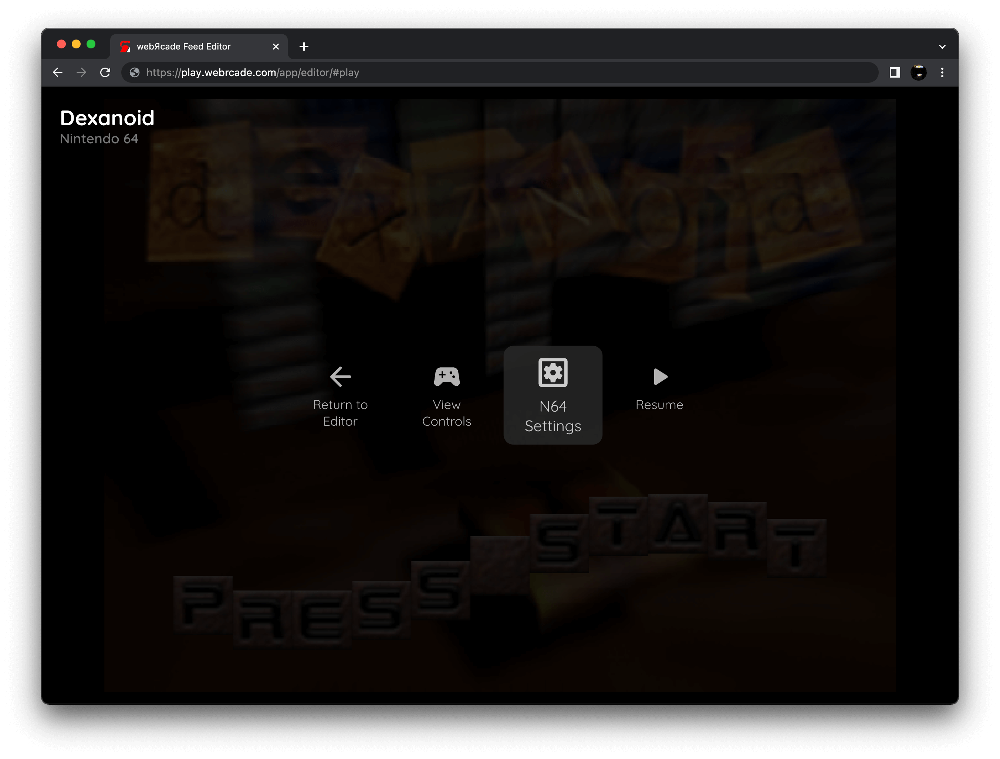
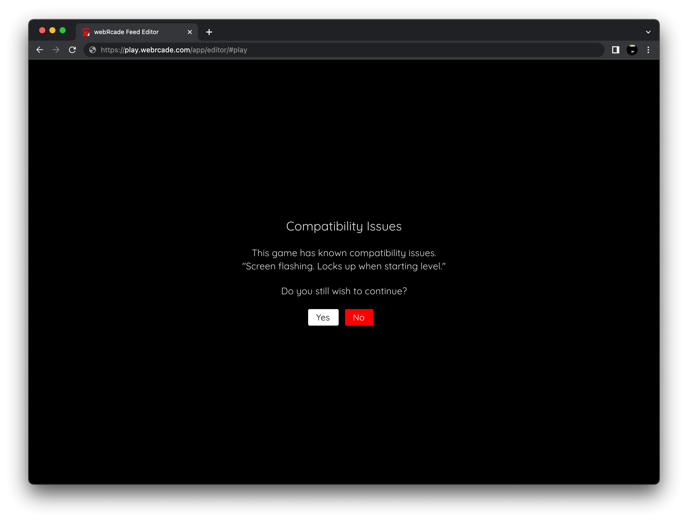

# Nintendo 64 (Experimental)

!!! warning
    The Nintendo 64 (N64) application is currently designated as an *experimental* application.
    <p>
    This designation has been applied due to the following:
    </p>
    <ul>
    <li>The resource requirements to properly run the emulator are high.</li>
    <li>Many games exhibit compatibility issues and defects.</li>
    </ul>
    <p>
    By default, *Experimental* applications are not displayed in the webЯcade *[player](../../../userguide/index.md)* or *[feed editor](../../../editor/index.md)*.
    </p>
    <p>
    To enable the N64 application, refer to the *advanced settings* sections of the player ([player advanced settings](../../../userguide/index.md#advanced-settings-tab)) or editor ([editor advanced settings](../../../editor/workspace/settings.md#advanced-tab)).
    </p>

## Overview

The Nintendo 64 (N64) application is an emulator for the [Nintendo 64 game console](https://en.wikipedia.org/wiki/Nintendo_64).

<figure>
  
  <figcaption>Dexanoid R1 by Protest Design</figcaption>
</figure>

Due to its high resource requirements (see *warning* at top of this page), the following devices are minimally recommended for running this application:

* Modern PC or Mac (M1-based Macs must *disable* the vertex cache, See [settings](#settings) below)
* iPhone 11 or iPad 9th Generation (or newer)
* Xbox Series X|S gaming consoles

Android-based devices are not currently recommended at this time due to poor performance with this application.

## Settings

The N64 Application includes a custom settings dialog.

{: class="center zoomD"}

To access these settings, display the "Pause" screen and select the "N64 Settings" option (*See screenshot above*).

{: class="center zoomD"}

The N64 Application-specific settings are detailed below:

| __Field__ | __Description__ |
| --- | --- |
| Vertex buffers | Whether to enable/disable the use of vertex buffers.<br><br>Under most circumstances, using vertex buffers will provide a performance increase. However, on certain platforms and/or devices having this option enabled can greatly decrease performance. For example, *Apple M1-based Macs perform poorly with this option enabled*.<br><br>If you are experiencing poor performance, try disabling this option to see if performance improves. |

## Game Compatibility

Many N64 games currently exhibit compatibility issues and defects with this application (emulator).

{: class="center zoomD"}

If a game is known to have defects, a screen similar to the one shown above will be displayed. If this screen is displayed, selecting "No" (not continuing) is highly recommended.

## Controls

The emulator supports up to four controllers. The keyboard and gamepad mappings are listed in the tables below.

### Keyboard

Keyboard support is only available for controller one.

| __Name__ | <div style="min-width:140px">__Keys__</div> | __Comments__ |
|--------------------------|---------------------------------------------| |
| Analog Stick | {: class="control"} {: class="control"} {: class="control"} {: class="control"}  | |
| Analog -25% | {: class="control"} | Reduces analog input by 25%.<br> Can be combined with __Control Key__ to reduce by 75%.<br><br>Useful in situations where the analog stick needs to be gently moved. |
| Analog -50% | {: class="control"} | Reduces analog input by 50%.<br>Can be combined with __Shift Key__ to reduce by 75%.<br><br>Useful in situations where the analog stick needs to be gently moved. |
| A | {: class="control"} | |
| B | {: class="control"} | |
| L | {: class="control"} | |
| R | {: class="control"} | |
| Z | {: class="control"} | |
| D-pad | {: class="control"} {: class="control"} {: class="control"} {: class="control"}  | |
| C Buttons | {: class="control"} {: class="control"} {: class="control"} {: class="control"}  | |
| Start | {: class="control"} | |
| Show Pause Screen | {: class="control"} | |

### Gamepad

Gamepad support is available for all controllers.

| __Name__ | <div style="min-width:140px">__Gamepad__</div> | __Comments__ |
| --- | --- | --- |
| D-pad                        |  {: class="control"} | |
| Analog Stick                         |  {: class="control"} | |
| A                       | {: class="control"} | |
| B                       | {: class="control"}  | |
| L                       | {: class="control"} | |
| R                       | {: class="control"}  | |
| Z                       | {: class="control"} &nbsp;or&nbsp; {: class="control"} | |
| C Buttons (up/down/left/right)  | {: class="control"} | |
| Start                        | {: class="control"} | Not available for Xbox and not recommended for iOS (see alternate)<br><br>Press the __Menu (Start) Button__. |
| Start<br>(Alternate)            | {: class="control"} &nbsp;and&nbsp; {: class="control"} | Hold down the __Right Trigger__ and click (press down) on the __Right Thumbstick__. |
| Show Pause Screen                    | {: class="control"} &nbsp;and&nbsp; {: class="control"} | Not available for Xbox and not recommended for iOS (see alternate 3 or 4)<br><br>Hold down the __Left Trigger__ and press the __Menu (Start) Button__. |
| Show Pause Screen<br>(Alternate)        | {: class="control"} &nbsp;and&nbsp; {: class="control"} | Not available for Xbox and not recommended for iOS (see alternate 3 or 4)<br><br>Hold down the __Left Trigger__ and press the __View (Back) Button__. |
| Show Pause Screen<br>(Alternate 2)        | {: class="control"} &nbsp;and&nbsp; {: class="control"} | Not available for Xbox and not recommended for iOS (see alternate 3 or 4)<br><br>Hold down the __X Button__ and press the __View (Back) Button__. |
| Show Pause Screen<br>(Alternate 3)        | {: class="control"} &nbsp;and&nbsp; {: class="control"} | Hold down the __Left Trigger__ and click (press down) on the __Left Thumbstick__. |
| Show Pause Screen<br>(Alternate 4)        | {: class="control"} &nbsp;and&nbsp; {: class="control"} | Hold down the __Left Trigger__ and click (press down) on the __Right Thumbstick__. |

## SRAM, EEPROM, Flash, and Controller Pak Storage

The N64 application supports preserving state from game cartridge-specific chips (SRAM, EEPROMs, Flash) and Controller Paks between sessions. This state is persisted in the browser's local storage or optionally to [cloud-based storage](../../../storage/index.md). State information will be persisted whenever the pause screen is displayed (or the game is exited). Therefore, the pause screen should be displayed periodically to ensure the state is properly persisted.

## Feed

This section details how N64 application instances can be added to feeds.

### Type

The type name for the N64 application is `parallel-n64`.

!!! note
    The alias `n64` also currently maps to this application. In the future, the `n64` alias may be mapped
    to another N64 application (different emulator implementation) if it is determined to be a
    more appropriate default.

### Properties

The table below contains the properties that are specific to the N64 application. These properties are
specified in the `props` object of a feed item.

| __Property__ | __Type__ | __Required__ | __Details__ |
|----------|------|----------|---------|
| rom | URL | Yes | URL to an N64 ROM file or a zip file containing a ROM file. |
| zoomLevel | Numeric | No | A numeric value indicating how much the display image should be zoomed in (0-40).<br><br>This property is typically used to hide the black borders that are present on some N64 games. |

### Example

The following is an example of a complete feed that consists of a single N64 application instance (`type` value of `n64`).
``` json hl_lines="11 13"
{
  "title": "N64 Feed",
  "longTitle": "Nintendo 64 Example Feed",
  "categories": [
    {
      "title": "N64 Games",
      "longTitle": "Nintendo 64 Games",
      "items": [
        {
          "title": "Dexanoid R1",
          "type": "n64",
          "props": {
            "rom": "https://dl.dropboxusercontent.com/s/ueukhxqno0jowm6/dexanoid.zip"
          }
        }
      ]
    }
  ]
}
```

## iOS 16 through 16.4 Performance Issues

!!! warning
    iOS versions 16 through 16.4 significantly affected the performance of the N64 application (emulator)

    This issue has been resolved in iOS 16.5+. Thus, *upgrading is the recommended way to resolve this issue*.

iOS operating system versions 16 through 16.4 for iPhones/iPads significantly affected the performance of the N64 application (emulator).

The reduction in performance was caused by a *Safari Experimental Feature* that was enabled by default in iOS 16 through 16.4.

Performance of the N64 application (emulator) can be restored by disabling the experimental feature or upgrading to iOS version 16.5 or newer (recommended).

{: class="center zoomD"}

To disable the experimental feature, perform the following steps:

* Open `Settings`, and select `Safari >` (*See screenshot above*)
* On the `Safari` page, select `Advanced >` (*See screenshot above*)
* On the `Advanced` page, select `Experimental Features >` (*See screenshot above*)
* On the `Experimental Features` page, disable the `GPU Process: WebGL` feature (*See screenshot above*)
* After completing these steps, the N64 application (emulator) should perform at a level similar to previous operating system versions

## References

- [Nintendo 64 Application GitHub Repository](https://github.com/webrcade/webrcade-app-parallel-n64)
