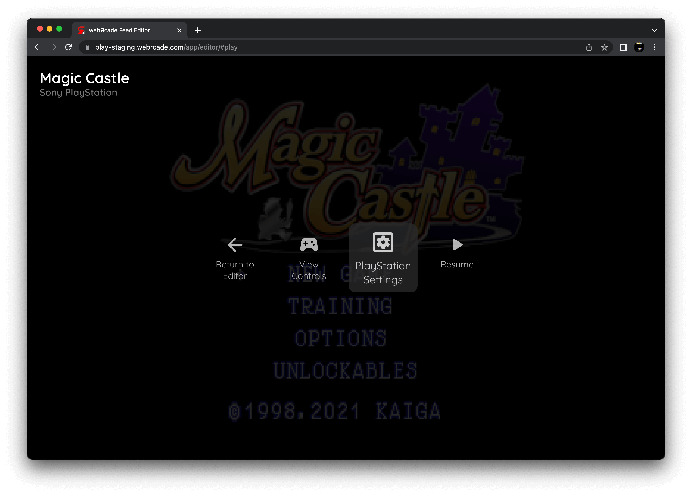
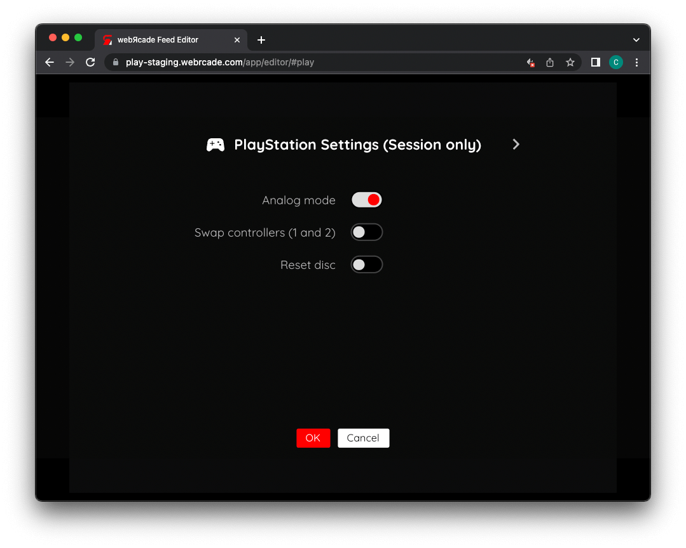
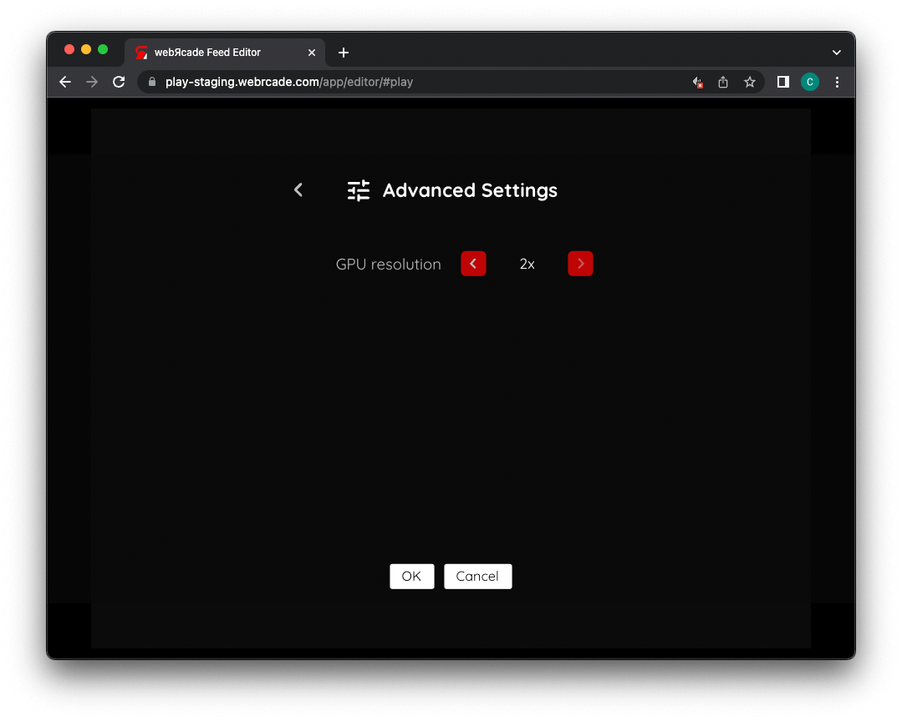

# Sony PlayStation

## Overview

The Sony PlayStation application is an emulator for the [Sony PlayStation game console](https://en.wikipedia.org/wiki/PlayStation_(console)).

<figure>
  
  <figcaption>Magic Castle by KAIGA</figcaption>
</figure>

Due to its high resource requirements, the following devices are minimally recommended for running this application:

* Modern PC or Mac
* iPhone 11 or iPad 9th Generation (or newer)
* Xbox Series X|S gaming consoles
* Newer Android devices with a highly performant processor (high single core speed)

## Adding Games (Feed Editor)

Due to large Disc image sizes, adding PlayStation games in the [Feed Editor](../../../editor/index.md) must be done manually (versus using auto-detection).

!!! important
    The PlayStation application only supports `.CHD` and `.PBP` disc file formats (`.ISO`, `.BIN`, and `.CUE` are not supported).

See the [Disc and Archive-based Items](../../../editor/workspace/addingitems.md#disc-and-archive-based-items) section for the list of steps required to add a PlayStation game in the [Feed Editor](../../../editor/index.md).

!!! important
    Both the iOS Safari and Xbox Series X|S Edge browsers limit the amount of memory that can be consumed by a particular web application (such as webЯcade).
    <p>
    The current limit is around 450 megabytes. Therefore, loading larger disc sizes may fail.
    </p>
    <p>
    To increase the likelihood of a game with a larger disc size loading, you can optionally choose to launch the game using a standalone-based link (versus launching the game within the webЯcade player or editor). See the [Standalone](../../../standalone/index.md) section of this documentation for further information (On Xbox, you would most likely want to bookmark the direct link. On iOS, you would most likely want to add the game to the home screen).
    </p>

## BIOS Files

In addition to Sony PlayStation Disc images, a set of *PlayStation BIOS files* must be specified globally within the feed (See the [Feed Properties Dialog](../../../editor/dialogs/feed-dialog.md#properties-tab) and [Sony PlayStation Feed Properties](#feed-properties) sections).

The BIOS files specified must be one of the following three sets:

*The BIOS files originally used on the PlayStation 1*.

| __File__ | __Hash (MD5)__ | __Description__ |
| --- | --- | --- |
| `scph5500.bin` | 8dd7d5296a650fac7319bce665a6a53c | PlayStation 1 Japan BIOS |
| `scph5501.bin` | 490f666e1afb15b7362b406ed1cea246 | PlayStation 1 USA BIOS |
| `scph5502.bin` | 32736f17079d0b2b7024407c39bd3050 | PlayStation 1 Europe BIOS |

*The PlayStation 1 BIOS file used on the PlayStation Portable*.

| __File__ | __Hash (MD5)__| __Description__ |
| --- | --- | --- |
| `PSXONPSP660.bin` | c53ca5908936d412331790f4426c6c33 | PlayStation Portable |

*The PlayStation 1 BIOS file used on the PlayStation 3*.

| __File__ | __Hash (MD5)__| __Description__ |
| --- | --- | --- |
| `ps1_rom.bin` | 81bbe60ba7a3d1cea1d48c14cbcc647b | PlayStation 3 |


## Settings

The Sony PlayStation Application includes a custom settings dialog.

{: class="center zoomD"}

To access these settings, display the "Pause" screen and select the "PlayStation Settings" option (*See screenshot above*).

{: class="center zoomD"}

### PlayStation Settings Tab (Session Only)

The PlayStation Application's "settings" tab is detailed below. It is important to note that the settings on this tab are *Session only* meaning they will not persist between gaming sessions.

| __Field__ | __Description__ |
| --- | --- |
| Analog mode | Enables *Analog mode* on the PlayStation DualShock controller. Some games will automatically force this mode. However, this setting allows for forcing the controller into analog mode. |
| Swap controllers (ports 1 and 2) | Swaps controllers 1 and 2. This is necessary in some games as they require the use of both controller ports (even during a single player game). |
| Reset Disc | This resets the state of the CD that is currently mounted. This is only required if a game does not automatically support creating a game save prior to requesting a disc swap. In those particular cases, the only way to resume the game on the other disc is to do the following: <p><ol><li>Play the game to the point where it requests a disc swap.</li><li>Create a [save state](../../../storage/#save-states) at this point (requires [cloud-storage](../../../storage/) to be enabled).</li><li>Exit out of the game and subsequently load the game with the requested disc.<li>Restore the save state once the game is loaded.</li><li>Finally, open the pause menu, and enable the "Reset Disc" option.</li><li>At this point, the game should continue.</li><ol></p> |

{: class="center zoomD"}

### Advanced Settings Tab

The PlayStation Application's "advanced" tab settings are detailed below.

| __Field__ | __Description__ |
| --- | --- |
| GPU Resolution | Controls the resolution to render each scene at internally.<br><br>This option will only affect 3D rendered items (not 2D). This improves the clarity of the visuals, primarily noticeable on larger screen resolutions. <br><br>NOTE: This setting significantly increases the required resources, and *will result in performance issues on a large number of devices*.  |

## Controls

The emulator supports up to four controllers. The keyboard and gamepad mappings are listed in the tables below.

### Keyboard

Keyboard support is only available for controller one.

| __Name__ | <div style="min-width:140px">__Keys__</div> | __Comments__ |
|--------------------------|---------------------------------------------| |
| D-pad | {: class="control"} {: class="control"} {: class="control"} {: class="control"}  | |
| Circle | {: class="control"} | |
| Cross | {: class="control"} | |
| Triangle | {: class="control"} | |
| Square | {: class="control"} | |
| L2 | {: class="control"} | |
| L1 | {: class="control"} | |
| R1 | {: class="control"} | |
| R2 | {: class="control"} | |
| Start | {: class="control"} | |
| Select | {: class="control"} | The __Right Shift Key__.|
| Show Pause Screen | {: class="control"} | |

### Gamepad

Gamepad support is available for all controllers.

| __Name__ | <div style="min-width:140px">__Gamepad__</div> | __Comments__ |
| --- | --- | --- |
| D-pad                         | {: class="control"} | |
| D-pad                         | {: class="control"} | When __Analog Mode__ disabled. |
| Left analog | {: class="control"} | When __Analog Mode__ enabled. |
| Right analog | {: class="control"} | When __Analog Mode__ enabled. |
| Circle                       | {: class="control"} | |
| Cross                       | {: class="control"}  | |
| Triangle                       | {: class="control"} | |
| Square                       | {: class="control"}  | |
| L2           | {: class="control"} | |
| L1           | {: class="control"} | |
| R1           | {: class="control"} | |
| R2           | {: class="control"}  | |
| Start                        | {: class="control"} | Not available for Xbox and not recommended for iOS (see alternate)<br><br>Press the __Menu (Start) Button__. |
| Start<br>(Alternate)            | {: class="control"} &nbsp;and&nbsp; {: class="control"} | Hold down the __Right Trigger__ and click (press down) on the __Right Thumbstick__. |
| Select                       | {: class="control"}  | Not available for Xbox and not recommended for iOS (see alternate)<br><br>Press the __View (Back) Button__. |
| Select<br>(Alternate)           | {: class="control"} &nbsp;and&nbsp; {: class="control"} | Hold down the __Right Trigger__ and click (press down) on the __Left Thumbstick__. |
| Show Pause Screen                    | {: class="control"} &nbsp;and&nbsp; {: class="control"} | Not available for Xbox and not recommended for iOS (see alternate 3 or 4)<br><br>Hold down the __Left Trigger__ and press the __Menu (Start) Button__. |
| Show Pause Screen<br>(Alternate)        | {: class="control"} &nbsp;and&nbsp; {: class="control"} | Not available for Xbox and not recommended for iOS (see alternate 3 or 4)<br><br>Hold down the __Left Trigger__ and press the __View (Back) Button__. |
| Show Pause Screen<br>(Alternate 2)        | {: class="control"} &nbsp;and&nbsp; {: class="control"} | Not available for Xbox and not recommended for iOS (see alternate 3 or 4)<br><br>Hold down the __X Button__ and press the __View (Back) Button__. |
| Show Pause Screen<br>(Alternate 3)        | {: class="control"} &nbsp;and&nbsp; {: class="control"} | Hold down the __Left Trigger__ and click (press down) on the __Left Thumbstick__. |
| Show Pause Screen<br>(Alternate 4)        | {: class="control"} &nbsp;and&nbsp; {: class="control"} | Hold down the __Left Trigger__ and click (press down) on the __Right Thumbstick__. |

## Memory Card Storage

The PlayStation application supports preserving state from Memory Cards between sessions. This state is persisted in the browser's local storage or optionally to [cloud-based storage](../../../storage/index.md). State information will be persisted whenever the pause screen is displayed (or the game is exited). Therefore, the pause screen should be displayed periodically to ensure the state is properly persisted.

## Feed

This section details how PlayStation application instances can be added to feeds.

### Type

The type name for the PlayStation application is `beetle-psx`.

!!! note
    The alias `psx` also currently maps to this application. In the future, the `psx` alias may be mapped
    to another PlayStation application (different emulator implementation) if it is determined to be a
    more appropriate default.

### Feed Properties

The table below contains global PlayStation feed properties. These properties must be specified in the `props` object of the feed's [Feed Object](../../../feeds/format.md#feed-object).

| __Property__ | __Type__ | __Required__ | __Details__ |
|----------|------|----------|---------|
| psx_bios | Array of URLs | Yes | <p>An array of URLs to PlayStation BIOS files.</p><p>The BIOS files must be one of the following three sets:<ul><li>(PS1) `scph5500.bin`, `scph5501.bin`, and `scph5502.bin`</li><li>(PSP) `PSXONPSP660.bin`</li><li>(PS3) `ps1_rom.bin`</li></ul></p>  |

### Item Properties

The table below contains the properties that are specific to the PlayStation application. These properties are
specified in the `props` object of a feed item.

| __Property__ | __Type__ | __Required__ | __Details__ |
|----------|------|----------|---------|
| uid | String | Yes | <p>A unique identifier for the particular game (must be unique across all PlayStation games).</p><p>This identifier is primarily used to associate persistent state with the game.</p>|
| discs | Array of URLs | Yes | <p>Array of URLs to one or more (for multi-disc games) PlayStation game discs.</p><p>The PlayStation application only supports `.CHD` and `.PBP` disc file formats (`.ISO`, `.BIN`, and `.CUE` are not supported).</p> |
| zoomLevel | Numeric | No | A numeric value indicating how much the display image should be zoomed in (0-40).<br><br>This property is typically used to hide the black borders that are present on some PlayStation games. |
| analog | Boolean | No | Enables *Analog mode* on the PlayStation DualShock controller. Some games will automatically force this mode. However, this setting allows for forcing the controller into analog mode. |
| multitap | Boolean | No | Enables multi-tap functionality when enabled (4 controllers). |
| skipBios | Boolean | No | Skips the PlayStation BIOS animation that is displayed when starting a game. |
| disableMemCard1 | Boolean | No | Whether to disable the use of memory card 1 (memory card 0 will still be available). |

### Example

The following is an example of a complete feed that consists of a single PlayStation application instance (`type` value of `psx`). The `discs` property value contains a URL that points to a Dropbox location that contains the excellent homebrew game Magic Castle by KAIGA. The `uid` property value contains a unique identifier for this specific game (must be unique across all PlayStation games).

It is also worth noting that the *PlayStation BIOS locations* (`psx_bios`) is specified globally within the [Feed Object's](../../../feeds/format.md#feed-object) `props` object.

``` json hl_lines="4-8 16 18-21"
{
  "title": "Sony PlayStation",
  "props": {
    "psx_bios": [
        "https://<host>/scph5500.bin",
        "https://<host>/scph5501.bin",
        "https://<host>/scph5502.bin"
    ]
  },
  "categories": [
    {
      "title": "Sony PlayStation Games",
      "items": [
        {
          "title": "Magic Castle",
          "type": "psx",
          "props": {
            "uid": "60f942b4-b4e5-47c0-9759-5d9d191c58e8",
            "discs": [
                "https://dl.dropboxusercontent.com/s/1fkmiszh1hj98d0/magiccastle.chd"
            ]
          }
        }
      ]
    }
  ]
}
```

## References

- [Sony PlayStation Application GitHub Repository](https://github.com/webrcade/webrcade-app-beetle-psx)

