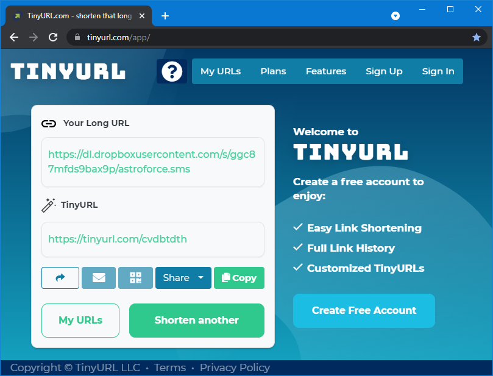
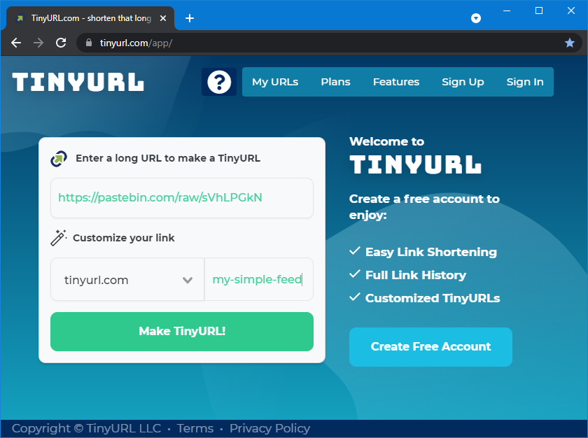
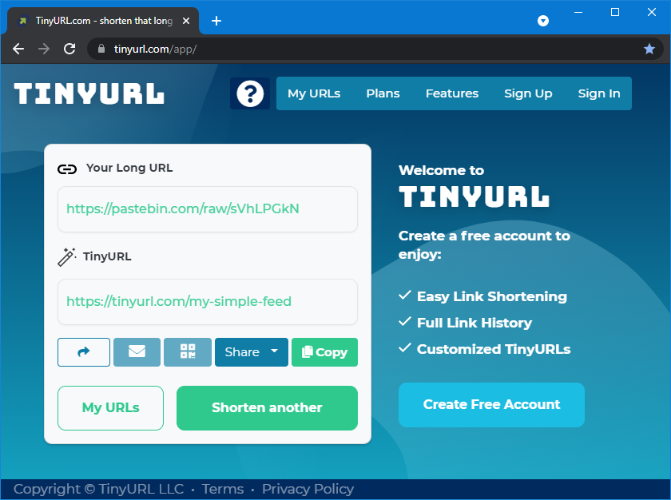

# TinyURL

[TinyURL](https://tinyurl.com/) can be used to both shorten and alias URLs. [Shortening of URLs](#shortened-urls) is recommended as it reduces the overall size of webЯcade feeds and mitigates false-positive blocking by simple URL filters. [Aliasing of URLs](#aliased-urls) can be utilized to provide more memorable (human-redable) URLs.


## Shortened URLs

Shortening of URLs that are located in webЯcade feeds is recommended as it reduces the overall size of feeds and mitigates false-positive blocking by simple URL filters. 

To shorten a URL with [TinyURL](https://tinyurl.com/), perform the following steps:

* Navigate to [TinyURL](https://tinyurl.com/).
* Enter the URL to shorten in the "`Enter a long URL...`" text field (see screenshot below).
* Click the "`Make TinyURL!`" button to shorten the URL.

{: style="padding:5px 15px;" class="center zoomD"}

* The shortened URL will be shown in the `"TinyURL`" result field as shown in the screenshot below.

{: style="padding:5px 15px;" class="center zoomD"}

The example below contains two tabs, one containing *"Full URLs"*, and one with the corresponding *"Shortened URLs"*. In this particular example, the URLs being shorted are for a thumbnail image and a Sega Master System ROM.

=== "Full URLs"
    ``` json hl_lines="6 12"
    {
      "title": "TinyURL Example Feed",
      "categories": [
        {
          "title": "Shooters",
          "thumbnail": "https://i.imgur.com/CEbGF7l.jpg",
          "items": [
            {
              "title": "Astro Force",
              "type": "sms",
              "props": {
                "rom": "https://dl.dropboxusercontent.com/s/ggc87mfds9bax9p/astroforce.sms"
              }
            }
          ]
        }
      ]
    }    
    ```
=== "Shortened URLs"    
    ``` json hl_lines="6 12"
    {
      "title": "TinyURL Example Feed",
      "categories": [
        {
          "title": "Shooters",
          "thumbnail": "https://tinyurl.com/yft4z7m8",
          "items": [
            {
              "title": "Astro Force",
              "type": "sms",
              "props": {
                "rom": "https://tinyurl.com/cvdbtdth"
              }
            }
          ]
        }
      ]
    }    
    ```

## Aliased URLs

 Aliasing of URLs can be utilized to provide more memorable (human-readable) URLs. Feed document URLs are primary candidates for aliasing as the resulting URLs are typically easier to share with others.

To alias a URL with [TinyURL](https://tinyurl.com/), perform the following steps:

* Navigate to [TinyURL](https://tinyurl.com/).
* Enter the URL to alias in the "`Enter a long URL...`" text field (see screenshot below).
* Enter an *alias* to associate with the specified URL in the "`Customize your link`" text field (see screenshot below).
    * *(Optional)* Select the domain to host the alias via the pull-down menu to the direct left of the alias text field.
* Click the "`Make TinyURL!`" button to alias the URL.

{: style="padding:5px 15px;" class="center zoomD"}

* The aliased URL will be shown in the `"TinyURL`" result field as shown in the screenshot below.

{: style="padding:5px 15px;" class="center zoomD"}

The example from above can be tested by adding a feed with the following URL within the webЯcade front-end:

`https://tinyurl.com/my-simple-feed`
