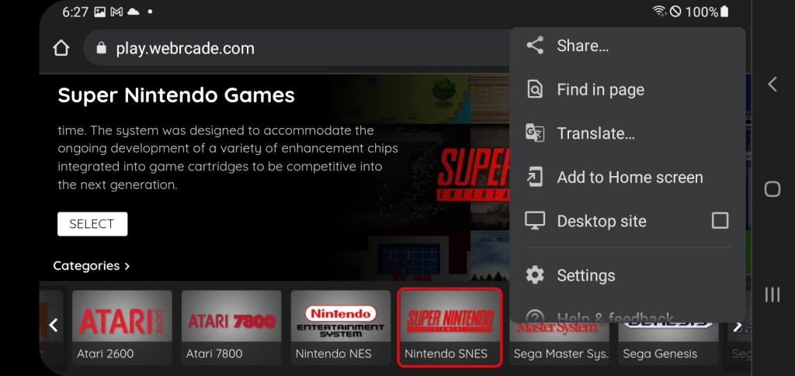
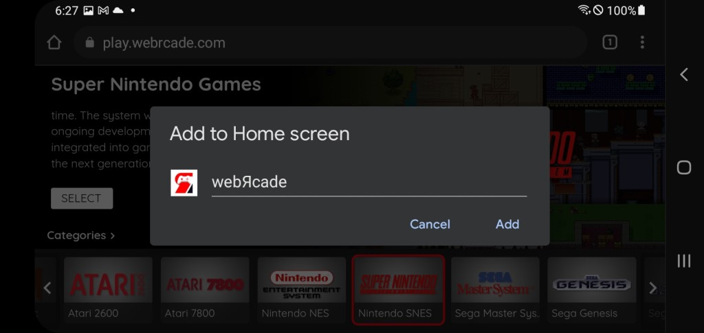
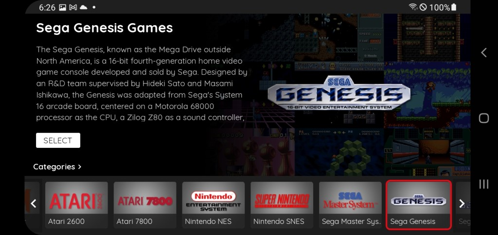

# Android

## Overview

This page provides information on how to obtain the optimal experience when using webЯcade with an Android-compatible device.

!!! note
    Recent changes to the audio components of the Chrome browser have negatively affected the performance
    of webЯcade on Android devices (due to typically lower single core performance). Therefore, to avoid audio issues (pops and stutters), an Android device with good performance benchmarks is required (a Samsung S10 was used for testing and didn't appear to exhibit any issues).
A new audio layer
    is being developed for a future webЯcade update that will reduce the performance
    requirements.

    

## Gamepad Support

The [Android Gamepads page](gamepads.md) provides detailed information on the various gamepads that have been tested for compatibility with webЯcade on the Android operating system.

## Browser Support

The recommended browser for use with webЯcade on an Android device is Chrome.

### Chrome

Chrome is currently the recommended browser for webЯcade on Android devices. 

#### Add to Home Screen

A lot of potential vertical space for webЯcade is consumed by the Chrome address bar, especially when the device is oriented horizontally (see screenshot below).

{: style="padding:5px 15px;" class="center zoomD"}

Fortunately, Chrome provides the ability to, "Add websites to the Home Screen". Adding webЯcade to the Android home screen simplifies launching it and increases the available vertical space (eliminates the address bar).  

To add webЯcade to the Home Screen, perform the following steps:

* Tap the :material-dots-vertical: `Kebab Menu (three vertical dots)` icon located in the top right corner of the screen (see screenshot above). 
* A context menu similar to the one shown in the screenshot below will be displayed.
* Select the `Add to Home Screen` menu item (see screenshot below).

{: style="padding:5px 15px;" class="center zoomD"}

* At this point, the `"Add to Home screen"` dialog should be displayed (see screenshot below).
* Tap the `"Add`" text located at the bottom right corner of the dialog.

{: style="padding:5px 15px;" class="center zoomD"}

* At this point, the `"Add to Home screen?"` dialog should be displayed (see screenshot below).
* Tap the `"Add`" text located at the bottom right corner of the dialog.

{: style="padding:5px 15px;" class="center zoomD"}

* The Home Screen should now include the webЯcade icon (see screenshot below, bottom right icon).
* Tapping the webЯcade icon will launch the webЯcade site.

{: style="padding:5px 15px;" class="center zoomD"}

* A screen similar to the one shown in the screenshot below should result from launching webЯcade from the Home Screen. The navigation bar should no longer be present, increasing the available vertical space.

{: style="padding:5px 15px;" class="center zoomD"}
