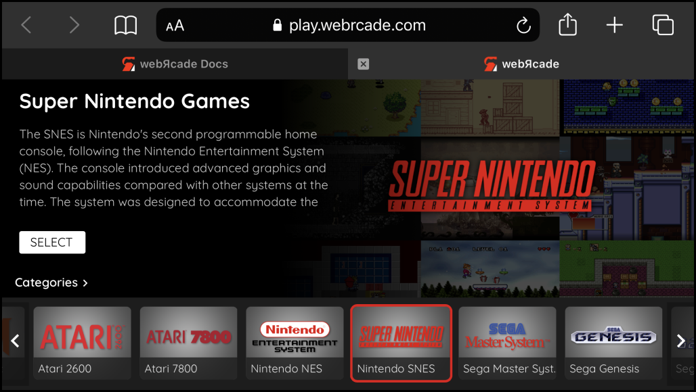
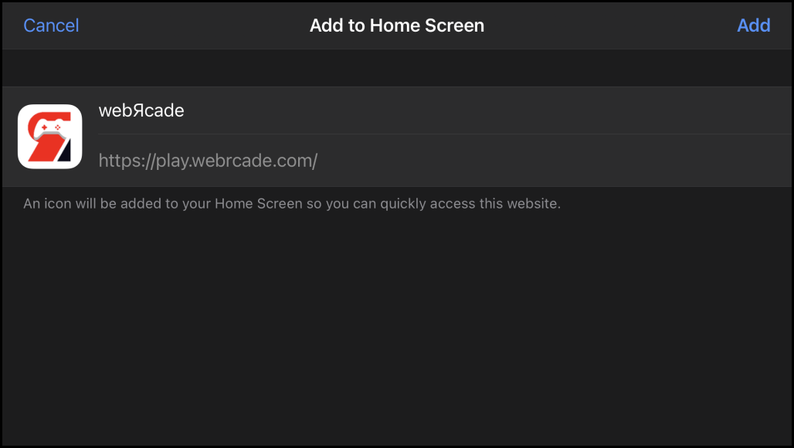
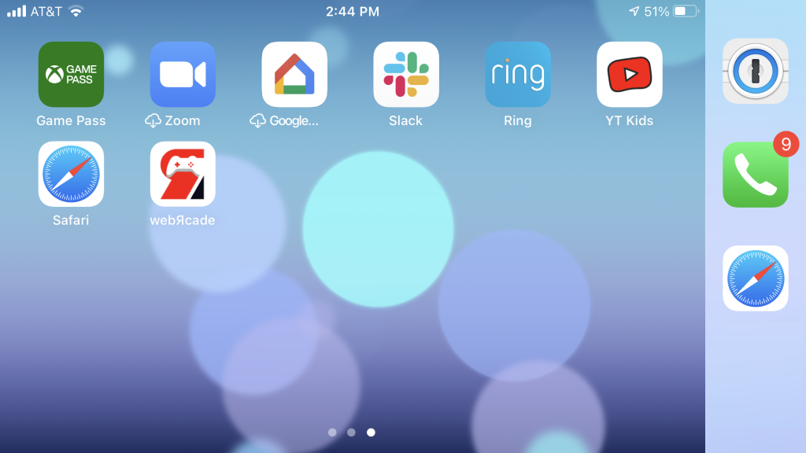
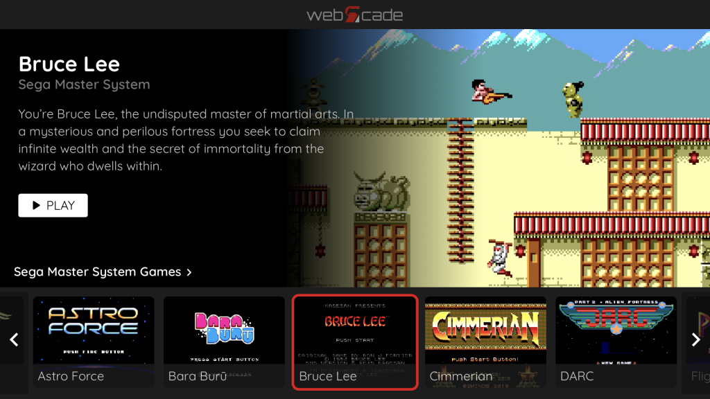

# iOS

## Overview

This page provides information on how to obtain the optimal experience when using webЯcade with an iOS-compatible device (iPad, iPod Touch, and iPhone).

## Gamepad Support

The [iOS Gamepads page](gamepads.md) provides detailed information on the various gamepads that have been tested for compatibility with webЯcade on the iOS operating system.

## Browser Support

The recommended browser for use with webЯcade on an iOS device is Safari due to its support for iOS specific features (ability to add websites to the Home Screen, etc.). It is also worth noting that all browsers on the iOS operating system currently use the iOS WebKit framework and WebKit JavaScript. Therefore, the differences between iOS browsers are limited to features outside of the core rendering engine.

### Safari

Safari is currently the recommended browser for webЯcade on iOS devices due to its support for iOS specific features (ability to add websites to the Home Screen, etc.). 

#### Add to Home Screen

A lot of potential vertical space for webЯcade is consumed by the Safari address bar and tabs, especially when the device is oriented horizontally (see screenshot below).

{: style="padding:5px 15px;" class="center"}

Fortunately, Safari provides the ability to, "Add websites to the Home Screen". Adding webЯcade to the iOS home screen simplifies launching it and increases the available vertical space (eliminates the address bar and tabs).  

To add webЯcade to the Home Screen, perform the following steps:

* Tap the :octicons-share-16: `Action (Share)` icon located in the top right corner (box with arrow pointing up) (see screenshot above). 
* A context menu similar to the one shown in the screenshot below will be displayed.
* Select the :octicons-diff-added-16: `Add to Home Screen` menu item (see screenshot below).

{: style="padding:5px 15px;" class="center"}

* At this point, the `"Add to Home Screen"` dialog should be displayed (see screenshot below).
* Tap the `"Add`" text located in the top right corner of the dialog to add webЯcade to the iOS Home Screen.

{: style="padding:5px 15px;" class="center"}

* The Home Screen should now include the webЯcade icon (see screenshot below).
* Tapping the webЯcade icon will launch the webЯcade site.

{: style="padding:5px 15px;" class="center"}

* A screen similar to the one shown in the screenshot below should result from launching webЯcade from the Home Screen. The navigation bar and tabs should no longer be present, increasing the available vertical space.

{: style="padding:5px 15px;" class="center"}

### Chrome

Chrome is not the currently recommended browser for webЯcade on iOS devices due to its lack of support for iOS specific features (ability to add websites to the Home Screen, etc.). Additionally, Chrome has been reported to periodically exhibit rendering glitches when navigating the webЯcade front-end.

