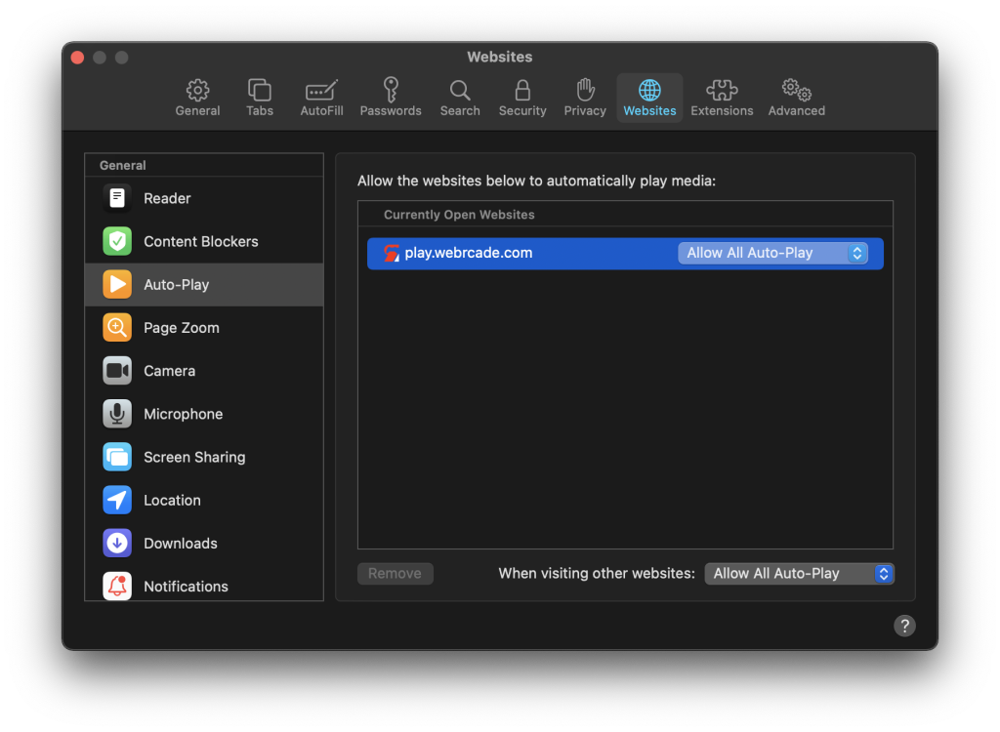
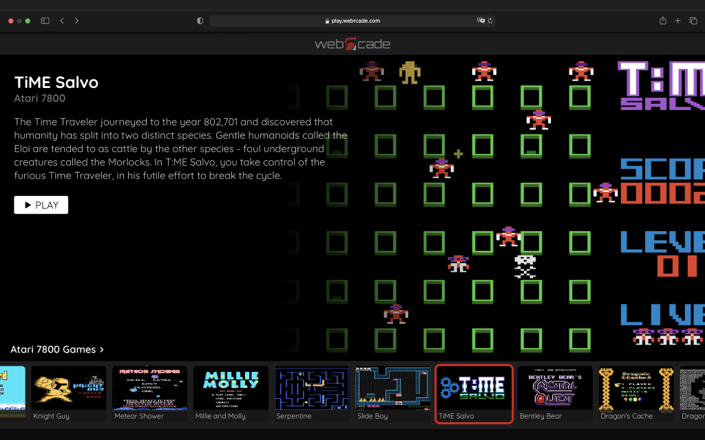
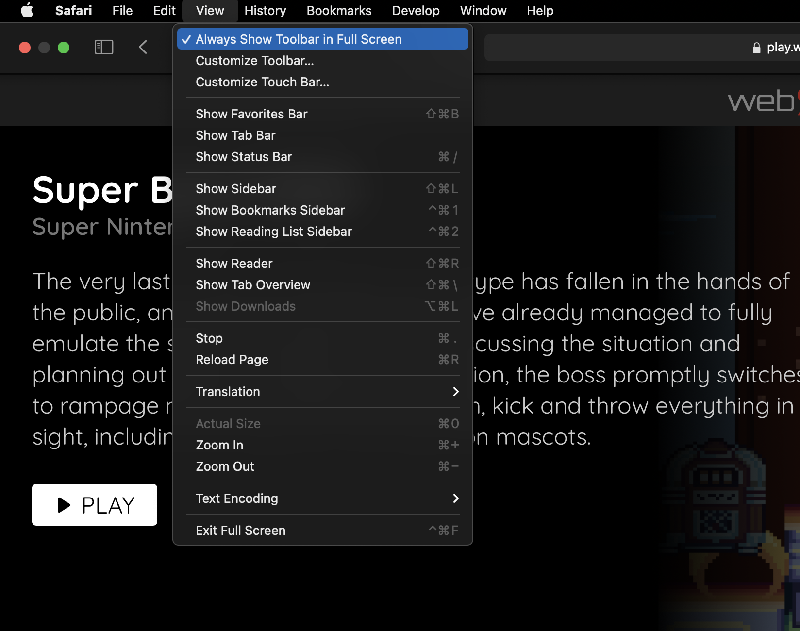

# macOS (Mac)

## Overview

This page provides information on how to obtain the optimal experience when using webЯcade with the macOS operating system on a Mac.

## Gamepad Support

The [macOS Gamepads page](gamepads.md) provides detailed information on the various gamepads that have been tested for compatibility with webЯcade on a Mac.

## Browser Support

The recommended browser for use with webЯcade on a Mac is [Google Chrome](https://www.google.com/chrome/) due to its extensive gamepad compatibility and minimal configuration. The Safari web browser is also compatible but supports fewer gamepads and additional steps are required to achieve an optimal experience ([see below](#safari)).

### Chrome

Chrome is the recommended browser for webЯcade when playing on a Mac due to its extensive support for gamepads as well as its minimal configuration. 

#### Full Screen

Chrome can be set to "full screen mode" by opening the `View` menu in the `Chrome` menu bar and selecting the `Enter Full Screen` menu item.

By default, "full screen mode" displays the navigation toolbar which contains the current URL and navigation buttons (See image below).

{: style="padding:15px;"}

To remove the navigation toolbar in "full screen mode" open the `View` menu in the `Chrome` menu bar and unselect the `Always Show Toolbar in Full Screen` menu item (see image below).

{: style="padding:15px;"}

### Safari

Safari is not currently the recommended browser for webЯcade due to its limited gamepad support and additional configuration steps for an optimal experience. The following sections document some of these optional configuration steps. 

#### Auto-Play

If "Auto-Play" has not been allowed for the webЯcade site, the message `"Click Screen to Unmute"` will be displayed (See image below). At this point, pressing any key or clicking on the screen will enable sound for the current game. 

To avoid receiving this message every time a game is launched, "Auto-Play" can be enabled for the webRcade site. 

* In the `Safari` menu bar, select the `Safari` menu and select the `Preferences...` menu item
* Select the `Websites` category at the top of the dialog (see image below)
* Select the `Auto-Play` option on the left (see image below)
* "Auto-Play" can be configured on a per-site basis or globally
    * To configure "Auto-Play" globally (for all sites), set the `When visiting other websites` pull-down at the bottom of the dialog to `Allow All Auto-Play` (see image below).
    * To configure "Auto-Play" only for the webЯcade site, select `Allow All Auto-Play` to the right of the `play.webrcade.com` site in the `Currently Open Websites` list (see image below).

#### Full Screen

Safari can be set to "full screen mode" by opening the `View` menu in the `Safari` menu bar and selecting the `Enter Full Screen` menu item.

By default, "full screen mode" displays the navigation toolbar which contains the current URL and navigation buttons (See image below).

{: style="padding:15px;"}

To remove the navigation toolbar in "full screen mode" open the `View` menu in the `Safari` menu bar and unselect the `Always Show Toolbar in Full Screen` menu item (see image below).

{: style="padding:15px;"}
