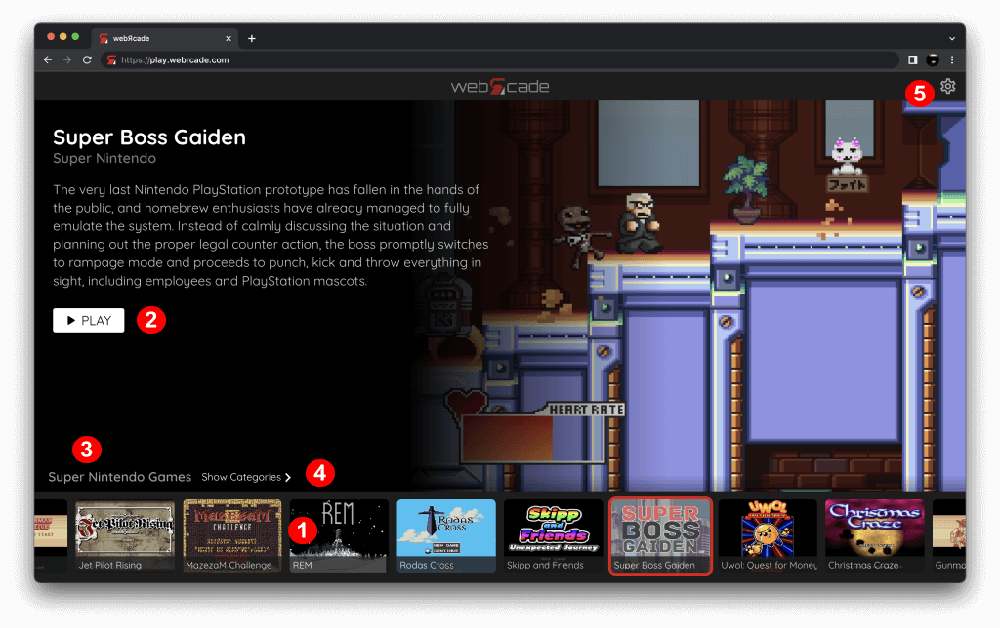
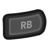
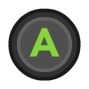
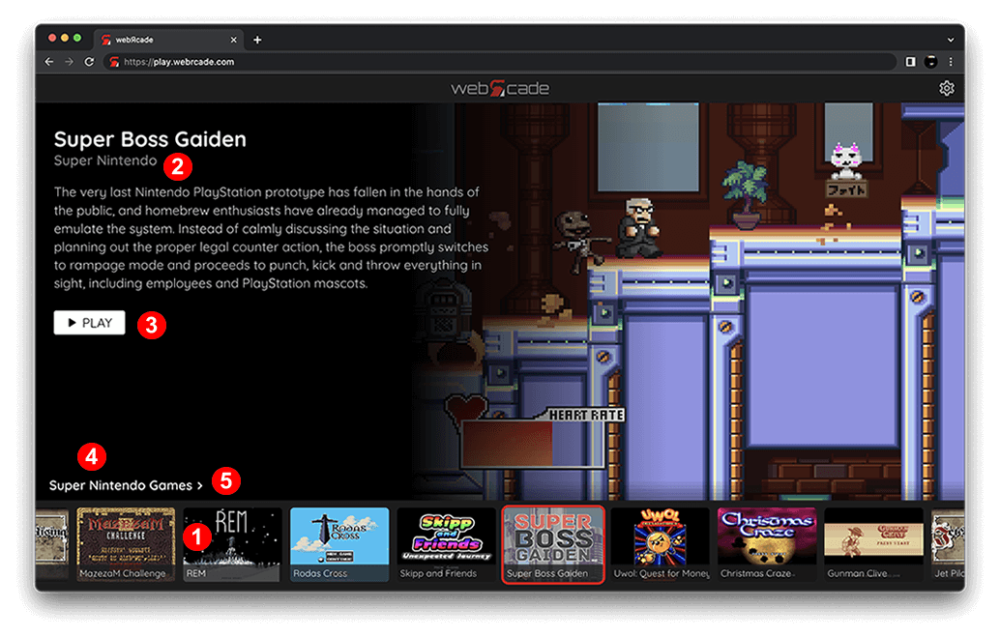
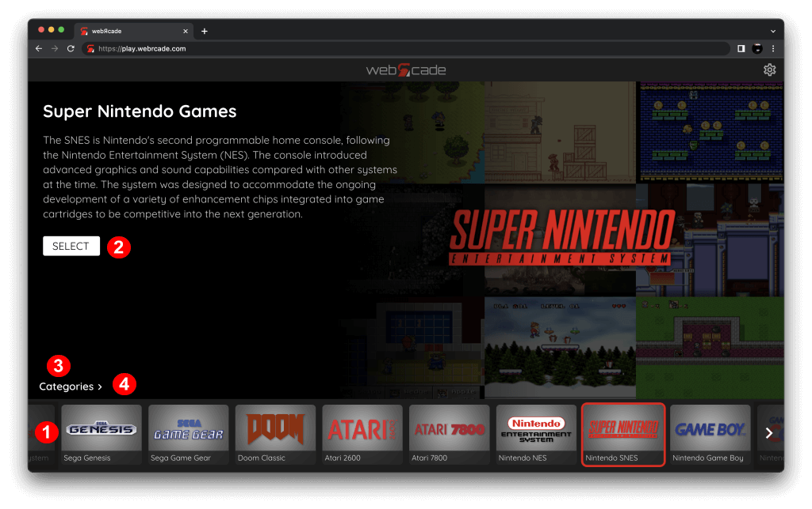
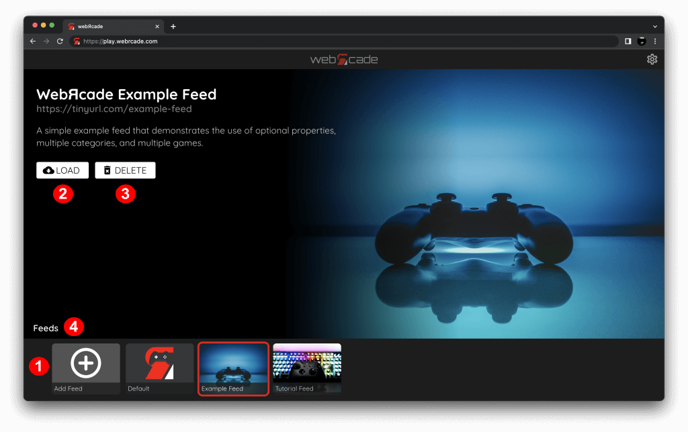
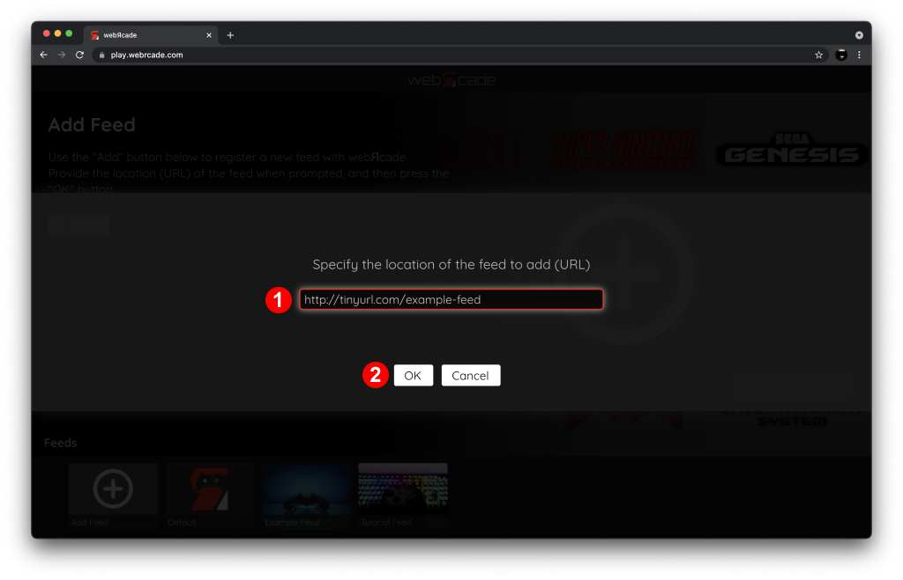
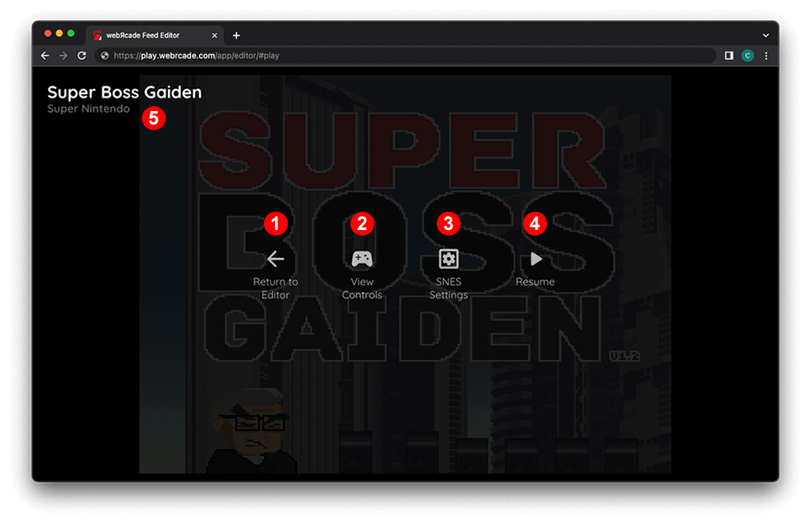

# User Guide

This user guide details the various screens that comprise the webЯcade front-end. 

The webЯcade front-end URL is listed below:

* [https://play.webrcade.com](https://play.webrcade.com){target=_blank}

{: style="padding:5px;" class="center"}

Three main screens form the webЯcade front-end and are hierarchical in nature:

* [Feeds View](#feeds-view) - Supports the management (adding, removing) and loading of webЯcade feeds. 
* [Categories View](#categories-view) - Consists of the categories that comprise the *currently loaded feed*.
* [Items View](#items-view) - Consists of the items (games, etc.) in the *currently selected category*.

Each of the views supports descending or ascending between the views described above. 

## Components

The components described below are common across the various webЯcade front-end views.

### Thumbnail Slider

The "Thumbnail Slider" component (*See #1 in screenshot above*) contains the set of thumbnails that are available for selecting in the current screen. When a thumbnail is selected the content above the slider is updated to reflect the current selection (name, description, images, and available actions).

The tables below describe the thumbnail slider input mappings for the various input types (keyboard, gamepad, and touch).

**Keyboard Controls**

| __Name__ | 
__Keys__
 | __Comments__ |
|--------------------------|---------------------------------------------| |
| Previous | {: class="control"} | Move to previous thumbnail. |                  
| Next  | {: class="control"} | Move to next thumbnail. |                  
| Previous Page | {: class="control"} or {: class="control"} | Move to previous page of thumbnails. | 
| Next Page | {: class="control"} or {: class="control"}| Move to next page of thumbnails. | 
| Select | {: class="control"} | Select the current thumbnail. | 

**Gamepad Controls**

| __Name__ | 
__Gamepad__
 | __Comments__ |
| --- | --- | --- |
| Previous | {: class="control"} or {: class="control"} `Left` | Move to previous thumbnail. |
| Next | {: class="control"} or {: class="control"} `Right` | Move to next thumbnail. |
| Previous Page | {: class="control"} | Move to previous page of thumbnails. |
| Next Page | {: class="control"} | Move to next page of thumbnails. |
| Select | {: class="control"}  | Select the current thumbnail. |

**Touch Controls**

| __Name__ | 
__Gesture__
 | __Comments__ |
| --- | --- | --- |
| Previous Page | :material-gesture-swipe-left:{ style="transform: scale(2.1); padding-right:5px" } Swipe left | Move to previous page of thumbnails. |
| Next Page | :material-gesture-swipe-right:{ style="transform: scale(2.1); padding-right:5px" } Swipe right | Move to next page of thumbnails. |
| Select | :material-gesture-tap:{ style="transform: scale(2.1); padding-right:5px" } Tap | Select thumbnail. |

### Action Buttons

The "Action Buttons" section (*See #2 in screenshot above*) contains the set of actions that are available for the currently selected thumbnail.

### Screen Title

The "Screen Title" label (*See #3 in screenshot above*) describes the current screen. 

* The title for the [Feeds View](#feeds-view) is *"Feeds"*.
* The title for the [Categories View](#categories-view) is *"Categories"*.
* The title for the [Items View](#items-view) is the name of the *currently selected category*.

### Navigate to Parent Flyout

When the [Screen Title](#screen-title) is focused, hovered, or tapped in the [Categories](#categories-view) or [Items](#items-view) views, the *"Navigate to Parent Flyout"* will be displayed (*See #4 in screenshot above*). 

Subsequently clicking, tapping, or selecting (Gamepad `A` button) the title/flyout will navigate to the parent view.

* [Items View](#items-view) navigates to [Categories View](#categories-view).
* [Categories View](#categories-view) navigates to [Feeds View](#feeds-view).

## Items View

The items view consists of items (primarily games) that can be played. 

{: style="padding:5px;" class="center"}

The thumbnail slider (*See #1 in screenshot above*) consists of the "items" contained within the *currently selected category* (*See #4 in screenshot above*). "Items" are typically games that can be played (*See #3 in screenshot above*). In the future, the type of items (application types) will be extended to include videos and other forms of content that can be played.  

The *application type* of the currently selected item is displayed directly under its title (*See #2 in screenshot above*). Refer to the [Applications](../apps/index.md) section for a complete list of available applications. Each detailed application page includes keyboard and gamepad control mappings along with addition information for the specific type (See the [Super Nintendo Application](../apps/emulators/snes/index.md) type as an example).

Clicking, tapping, or selecting (Gamepad `A` button) the title/flyout (*See #5 in screenshot above*) will navigate to the [Categories View](#categories-view).

## Categories View

The categories view consists of the categories that are included in the *current webЯcade feed*. 

{: style="padding:5px;" class="center"}

The thumbnail slider (*See #1 in screenshot above*) consists of the categories included in the *current webЯcade feed*. The `Select` button (*See #2 in screenshot above*) can be pressed to display the "items" (See [Items View](#items-view)) that comprise the currently selected category. The screen title for the categories view is always, "Categories" (*See #3 in screenshot above*). 

Clicking, tapping, or selecting (Gamepad `A` button) the title/flyout (*See #4 in screenshot above*) will navigate to the [Feeds View](#feeds-view).

## Feeds View

The feeds view supports the management (adding, removing) and loading of webЯcade feeds. 

{: style="padding:5px;" class="center"}

The thumbnail slider (*See #1 in screenshot above*) consists of the feeds that have been registered with webЯcade. In addition to registered feeds, the slider includes the following two standard thumbnails:

* `Add Feed` - When the `Add Feed` thumbnail is selected, an `Add` button will be displayed in the actions button location (See [Action Buttons](#action-buttons)). Pressing on the `Add` button will result in the [Add Feed Dialog](#add-feed-dialog) being displayed.
* `Default` - The `Default` thumbnail represents the *default* webЯcade feed that consists of high-quality publicly available games and demos, and may not be deleted. 

Loading the currently selected feed (*See #2 in screenshot above*) will result in the feed being loading and its associated content being displayed (See [Categories](#categories-view) and [Items](#items-view) views).

Pressing the `Delete` button (*See #3 in screenshot above*) will result in the [Delete Feed Dialog](#delete-feed-dialog) being displayed.

The screen title for the feeds view is always, "Feeds" (*See #4 in screenshot above*). 

### Add Feed Dialog

The "Add Feed Dialog" allow for additional feeds to be registered with webЯcade.

{: style="padding:5px;" class="center"}

To register a new feed, enter the location of the feed to add (its URL) in the feed text box (*See #1 in screenshot above*). Once the feed URL has been provided, press the `OK` button (*See #2 in screenshot above*). 

If the URL is valid and the feed is successfully loaded, the content associated with the feed will be displayed (See [Categories](#categories-view) and [Items](#items-view) views). The newly registered feed will also be available for future loading within the feeds view. 

### Delete Feed Dialog

The "Delete Feed Dialog" allows for the selected feed to be deleted (unregistered) from webЯcade.

{: style="padding:5px;" class="center"}

To remove the feed, select the `Yes` button within the delete dialog (See screenshot above).

## Pause Screen

The "Pause Screen" can be displayed when an item (game, etc.) is running. The pause screen supports the ability to exit the currently running item (game, etc.) and return to the webЯcade front-end.

{: style="padding:5px;" class="center"}

Currently, the pause screen only consists of the following two items. 

* `Return to Browse` (*See #1 in screenshot above*) - Returns to the most recent [Items View](#items-view).
* `Resume` (*See #2 in screenshot above*) - Resumes playing the current item (game, etc.).

In the future, the options available within the pause screen may be extended to include application-specific configuration settings, save state management, etc.

The *application type* of the currently playing item (game, etc.) is displayed directly under its title (*See #3 in screenshot above*). Refer to the [Applications](../apps/index.md) section for a complete list of available applications. Each detailed application page includes keyboard and gamepad control mappings along with addition information for the specific type (See the [Super Nintendo Application](../apps/emulators/snes/index.md) type as an example).

The following tables include the button mappings that can be used to display the "Pause Screen" when an item (game, etc.) is running.

**Keyboard Controls**

| __Name__ | 
__Keys__
 | __Comments__ |
|--------------------------|---------------------------------------------| |
| Show Pause Screen | {: class="control"} |  |                  

**Gamepad Controls**

| __Name__ | 
__Gamepad__
 | __Comments__ |
| --- | --- | --- |
| Show Pause Screen | {: class="control"} &nbsp;and&nbsp; {: class="control"} | Not available for Xbox and not recommended for iOS (see alternate 3 or 4)  Hold down the __Left Trigger__ and press the __Menu (Start) Button__. |
| Show Pause Screen (Alternate) | {: class="control"} &nbsp;and&nbsp; {: class="control"} | Not available for Xbox and not recommended for iOS (see alternate 3 or 4)  Hold down the __Left Trigger__ and press the __View (Back) Button__. |
| Show Pause Screen (Alternate 2)        | {: class="control"} &nbsp;and&nbsp; {: class="control"} | Not available for Xbox and not recommended for iOS (see alternate 3 or 4)  Hold down the __X Button__ and press the __View (Back) Button__. |
| Show Pause Screen (Alternate 3)        | {: class="control"} &nbsp;and&nbsp; {: class="control"} | Hold down the __Left Trigger__ and click (press down) on the __Left Thumbstick__. |
| Show Pause Screen (Alternate 4)        | {: class="control"} &nbsp;and&nbsp; {: class="control"} | Hold down the __Left Trigger__ and click (press down) on the __Right Thumbstick__. |

**Touch Controls**

| __Name__ | 
__Gesture__
 | __Comments__ |
| --- | --- | --- |
| Show Pause Screen | :material-gesture-tap:{ style="transform: scale(2.1); padding-right:5px" } Tap | Tap screen to show pause screen.  |

